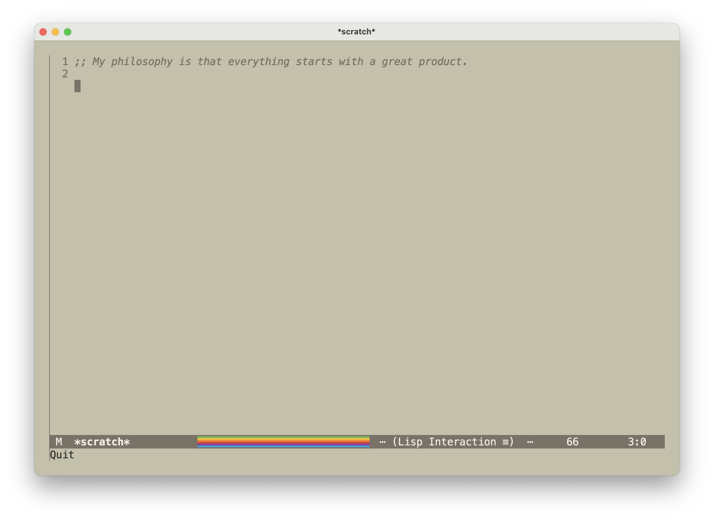

# year-1984 — Emacs theme inspired by classic Apple “Beige” from 1984

**year-1984** is a light theme for GNU Emacs, inspired by the original Pantone 453 “Apple Beige” color used on the first 
Macintosh computers released in 1984.  
The goal is to capture the soft, warm nostalgia of vintage Apple hardware in your editor.

The whole project has been inspired by a Mastodon post from [Michał M. Sapka](https://michal.sapka.pl) ... that I think got deleted ...
Anyway, thanks for the inspiration Michał!

---

## Main Features

- Color palette based on the Apple “Putty” beige tone (Pantone 453), characteristic of Macintosh models from 1984–1986  
- Warm, sandy base tones with subtle highlights in khaki, light amber, and soft grays  
- Unified styling for mode-line, region, fringe, tooltip, isearch, rainbow-delimiters, line-numbers, minibuffer, font-lock, and more  
- Italic styling for comments to visually soften emphasis and reduce noise  

---

## Installation

### Melpa package

This package is published on the Milkypostman’s Emacs Lisp Package Archive, better known as [MELPA](https://melpa.org/), the best repository for Emacs Packages out there. To install it, just add the Melpa repository to your init file and then

```
(use-package year-1984-theme :ensure t)
(load-theme 'year-1984 t)
```

### Manual

- Clone or download the repository  
- Add its folder to your `custom-theme-load-path` (e.g. in your `init.el`)  
- Load the theme with: `

```
(load-theme 'year-1984 t)
```

---

## Configuration Tips

To maximize visual coherence and authenticity:

- Disable tool-bar, menu-bar, and scroll-bar for a cleaner look  
- Choose fonts like JetBrains Mono, Fira Code, or Source Code Pro  
- Try the BlexMono nerd font for a vintage look. On MacOS `brew install --cask font-blex-mono-nerd-font`
- Check my other projects: [steve](https://github.com/mastro35/steve) and [sixcolors-mode](https://github.com/mastro35/sixcolors-mode/tree/4124a8cf664b04a4bf4c39f7c3b7da3e480b99c8) to complete your Appleish setup!
- If you prefer dark themes, consider [sixcolors-theme](https://github.com/mastro35/sixcolors-theme).
---

## Screenshots



---

##  License

This theme is licensed under the **Apache License 2.0**. 
See the `LICENSE` file in the repository for full terms.

---

## Credits

Created by **Davide Mastromatteo**

Contributions, feedback, and pull requests are welcome on GitHub.

---

> “Inspired by the putty-toned legacy of Apple Beige—from which the Mac of 1984 emerged.”

---

### Background on Apple Beige

The early Macintosh models (128K, 512K, early Plus) used a custom beige paint based on Pantone 453, designed by Jerry Manock 
and Apple’s early industrial design team.  

This hue, sometimes referred to as “putty,” predated Apple’s later shift to the cooler “Platinum” gray in 1987.
Over time, thanks to UV exposure, the plastic shells aged into a more yellowish tone—but the intended design was a soft neutral beige 
that blended into office surroundings of the era.

---
